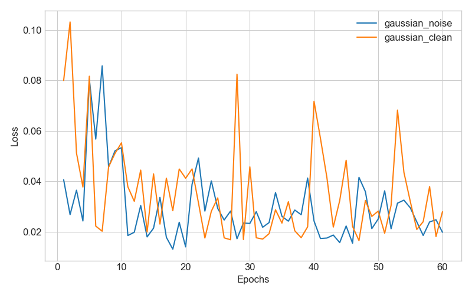
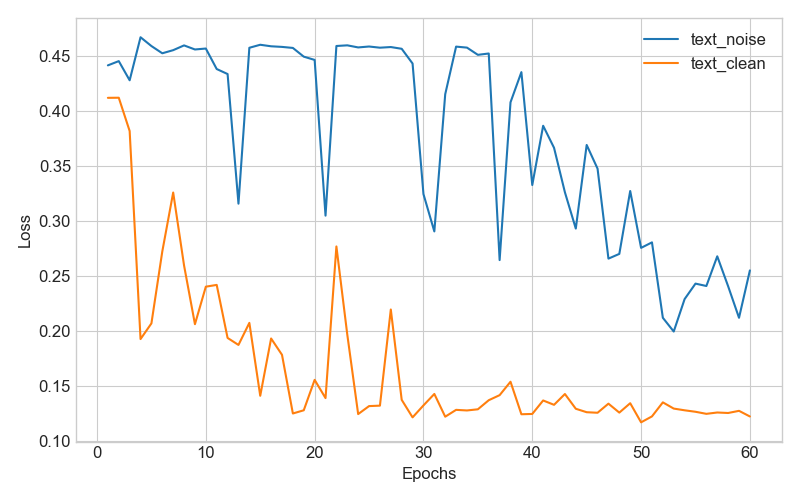
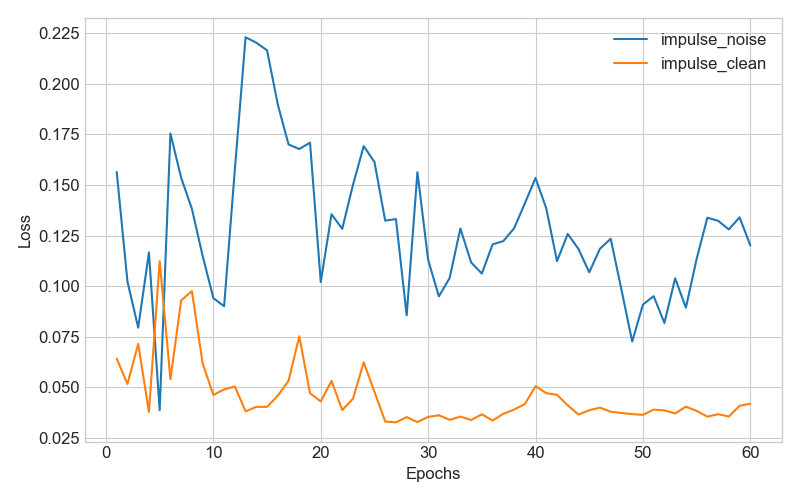
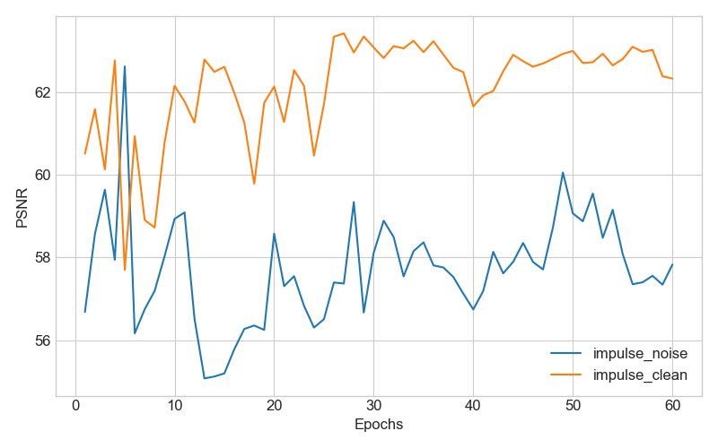

Noise2Noise (PyTorch Implementation)

This repository contains an unofficial PyTorch re-implementation of Noise2Noise: Learning Image Restoration without Clean Data, originally proposed by Lehtinen et al. at ICML 2018.

    🔗 Original Keras implementation: https://github.com/yu4u/noise2noise

    🔗 This PyTorch version: https://github.com/rainbowsummer0529/Noise2Noise

🚀 Highlights

    ✅ Fully re-implemented using PyTorch 2.7.0 + CUDA 11.8

    ✅ Supports both SRResNet and UNet architectures

    ✅ Compatible with multiple noise models: Gaussian, Text Insertion, and Random-valued Impulse Noise

    ✅ Reproducible training/testing pipelines

    ✅ Easy to extend and customize

📦 Dependencies

Install the required packages:

pip install -r requirements.txt

Key libraries:

    torch >= 2.7.0

    torchvision

    numpy

    opencv-python

    matplotlib

    tqdm

    Pillow

📁 Dataset Preparation

### Download Dataset

```bash
mkdir dataset
cd dataset
wget https://cv.snu.ac.kr/research/VDSR/train_data.zip
wget https://cv.snu.ac.kr/research/VDSR/test_data.zip
unzip train_data.zip
unzip test_data.zip
cd ..
```

Any dataset can be used in training and validation instead of the above dataset.


The training folder should now contain:
```bash
dataset/
├── 291/           # Training images
└── Set14/         # Test images
```
🏋️ Train the Model

Use the following commands to train the model with different settings.
Gaussian Noise (Noise2Noise Training)

```bash
# train model using (noise, noise) pairs (noise2noise)
python train.py --image_dir dataset/291 --test_dir dataset/Set14 --image_size 128 --batch_size 8 --lr 0.001 --output_path gaussian

# train model using (noise, clean) paris (standard training)
python train.py --image_dir dataset/291 --test_dir dataset/Set14 --image_size 128 --batch_size 8 --lr 0.001 --target_noise_model clean --output_path clean
```
Text Insertion Noise
```bash
# train model using (noise, noise) pairs (noise2noise)
python train.py --image_dir dataset/291 --test_dir dataset/Set14 --image_size 128 --batch_size 8 --lr 0.001 --source_noise_model text,0,50 --target_noise_model text,0,50 --val_noise_model text,25,25 --loss mae --output_path text_noise

# train model using (noise, clean) paris (standard training)
python train.py --image_dir dataset/291 --test_dir dataset/Set14 --image_size 128 --batch_size 8 --lr 0.001 --source_noise_model text,0,50 --target_noise_model clean --val_noise_model text,25,25 --loss mae --output_path text_clean
```
Random Impulse Noise
```bash
# train model using (noise, noise) pairs (noise2noise)
python train.py --image_dir dataset/291 --test_dir dataset/Set14 --image_size 128 --batch_size 8 --lr 0.001 --source_noise_model impulse,0,95 --target_noise_model impulse,0,95 --val_noise_model impulse,70,70 --loss l0 --output_path impulse_noise

# train model using (noise, clean) paris (standard training)
python train.py --image_dir dataset/291 --test_dir dataset/Set14 --image_size 128 --batch_size 8 --lr 0.001 --source_noise_model impulse,0,95 --target_noise_model clean --val_noise_model impulse,70,70 --loss l0 --output_path impulse_clean
```
🧪 Test the Model
```bash
python test_model.py --weight_file [trained_model_path] --image_dir dataset/Set14
```

🧠 Noise Models

Noise types supported:

    gaussian,min_std,max_std (e.g., gaussian,0,50)

    text,min_occ,max_occ (e.g., text,0,50)

    impulse,min_occ,max_occ (e.g., impulse,0,95)

    clean (no noise, for supervised target)

You can visualize how noise is added:
```bash
python noise_model.py --noise_model text,0,95
```

📈 Plot Training History
```bash
python plot_history.py --input1 gaussian --input2 clean
```
##### Gaussian noise



##### Text insertion



#### Random-valued impulse noise






	

More results and PSNR plots are available in the result/ folder.

📚 Reference

    [1] J. Lehtinen, J. Munkberg, J. Hasselgren, S. Laine, T. Karras, M. Aittala,T. Aila, "Noise2Noise: Learning Image Restoration without Clean Data," in Proc. of ICML, 2018.

    [2] J. Kim, J. K. Lee, and K. M. Lee, "Accurate Image Super-Resolution Using Very Deep Convolutional Networks," in Proc. of CVPR, 2016.

    [3] X.-J. Mao, C. Shen, and Y.-B. Yang, "ImageRestoration Using Convolutional Auto-Encoders withSymmetric Skip Connections," in Proc. of NIPS, 2016.

    [4] C. Ledig, et al., "Photo-Realistic Single Image Super-Resolution Using a Generative Adversarial Network," in Proc. of CVPR, 2017.

    [5] O. Ronneberger, P. Fischer, and T. Brox, "U-Net: Convolutional Networks for Biomedical Image Segmentation," in MICCAI, 2015.

    [6] Yu4u original Keras code: https://github.com/yu4u/noise2noise

💬 Contact

If you find this PyTorch re-implementation useful or have any issues, feel free to open an issue or reach out.
